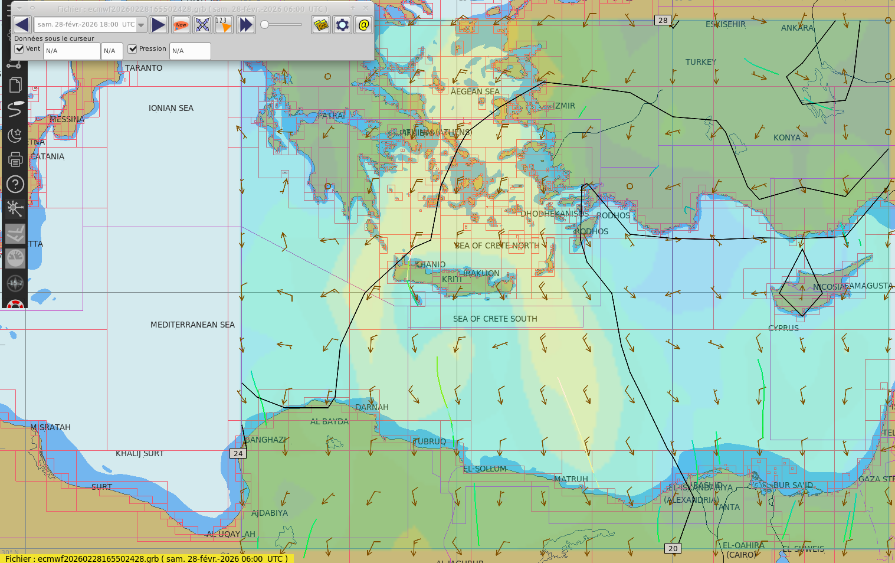

# MarineGRIB-InReach-Service

NOTE: In branch "chatgpt_conversation_module", I've added a ChatGPT module that leverages the OpenAI GPT-4 model to enable the Garmin user to ask any questions while being on open seas. 

Before setting out on our year-long sailing voyage, we needed a solution for accessing crucial weather data while being out on the open sea without internet connection. With this handy tool, we can now pull GRIB files on-demand using the Garmin inReach device, which turned out to be a cost-effective workaround to pricier options like IridiumGo. The system's entire process is illustrated in the following diagram:


Credit goes to Rhycus for the initial idea behind this workflow (https://github.com/rhycus/GRIB-via-inReach). Rather than merely sending specific location data and compressed wind details, this code goes a step further by transmitting the entire GRIB file. This provides access to a broader range of weather parameters, including pressure and waves. Additionally, the enhanced compression techniques allow for a similar number of messages and the weather data can now be analysed by using a GRIB viewer app that can interpolate data across different time points and zoom levels.

Feel free to use and modify the code to your needs. However, keep in mind that it depends on multiple APIs and libraries, which are subject to change. Always review the code thoroughly before using it, and proceed at your own risk!


## PREREQUISITES

- GARMIN INREACH: Make sure you have a Garmin inReach device with an active subscription. The unlimited message plan is recommended: https://www.garmin.com/en-US/p/837461/pn/010-06005-SU
- GMAIL SETUP: Create a dedicated Gmail account. Make sure the Gmail API is set up and you have the credentials.json files downloaded: https://developers.google.com/gmail/api/quickstart/python. Make sure to change the release status from test to production, otherwise authorisation will expire after 7 days!
- HOSTING: Use PythonAnywhere or another hosting service to run your script.
- DEVICE SETUP: Ensure you have a device like a tablet or computer with Jupyter Notebook to run the decoder and a GRIB file viewer app.


## REQUESTING GRIB

To request a GRIB-file, send a message to the dedicated Gmail adress via the Garmin inReach with specified weather model, location range, grid size, times and weather paramters. Here's an example of such a request:

```ecmwf:24n,34n,72w,60w|8,8|12,48|wind,press```

This translates to a request for data based on the ECMWF model, covering latitudes from 24N to 34N and longitudes from 72W to 60W, sampled at 8-degree intervals. The forecast times are 12 and 48 hours, and the requested weather parameters are wind and pressure.


## RECEIVING SERVICE

The PythonAnywhere-based receiving service routinely checks the Gmail inbox at one-minute intervals for new requests. This task is managed by the continuous operation of the main.py file. Upon identifying a new message, it forwards the request to the Saildocs email API (http://www.saildocs.com/gribinfo). Saildocs promptly responds by sending an email with the requested GRIB file attached to our Gmail.

Subsequently, the binary content of the GRIB file is extracted, compressed (zipped), and encoded using base64. This compression step effectively reduces the file size by approximately 35%. The processed data is then divided into smaller chunks, prepared for transmission back to the inReach device. The transmission occurs via a post-request, utilising the designated inReach link provided with the initial request message.

**NOTE:** Base 64 encoding uses a character set of {A–Z, a–z, 0–9, +, /}, making it suitable for message transmission. While a base 85 representation could further compress the data, reducing its size by an additional 10%, it involves many special characters. These require extra attention. For instance, Rhycus faced issues with certain character combinations like '>f' that were unsendable and demanded extra handling through character shift which may result in sending more messages than anticipated.

**NOTE:** As Rhycus pointed out, messages occasionally get truncated around the 130-140 character range. To circumvent this, we've capped each message to 120 characters.


## DECODING MESSAGE

The messages received on the inReach device appear as follows (based on the request above):

**Message 1**
```
msg 0/1: <--- Indicates beginning of the first message
eJxzD/J0YmCIY2RgkGFKmvW/QTGTgUucQ5yBgZGBh4uBgUEUxGJQYPjPwMDCwMwQe6BR0qGBYY5Dw+4GeQd5BwcGMBBjYWA45Fx+jV3uZOtdi80Mdvu4FcyB
end <--- Indicates end of the first message
```

**Message 2**
```
msg 1/1: <--- Indicates beginning of the second message
wB236QYkmu62I4u94O5mA9bUhKCWPw0I0xPgpiuR5XYJDqDp0ZmvOAJaPKsjPDonyjAo7mEgYD4JroeYr1/FoZPsla2rF7Zisi3DUrD5AIClUBs=
end <--- Indicates end of the second message
```

To decode these messages efficiently, open them via the Garmin Earthmate App on an iPad. Then, copy and paste the messages into the Decoder Jupyter Notebook, for instance, using the Carnets App. Once decoded, you can view the resulting GRIB-file with a GRIB viewer app, such as LuckGrib.


## EXAMPLE ATLANTIC
Utilising this method, you can acquire wind and pressure data for the Atlantic crossing with two time points with just 6 messages.

**Request:**

```ecmwf:44n,10n,75w,10w|8,8|12,48|wind,press```


**Result (in GRIB viewer app):**


## Example
```ecmwf:30n,40n,20e,35e|1,1|12|wind,press```
File: [files/attachments/ecmwf20260228165502428.grb](files/attachments/ecmwf20260228165502428.grb)
File size: 802 bytes

```bash
uv run demo_grib_to_cli.py files/attachments/ecmwf20260228165502428.grb --show-payload
```
```=== GRIB Encode/Split Demo ===
File: files/attachments/ecmwf20260228165502428.grb
Original bytes: 802
Compressed bytes (zlib): 682
Base64 chars: 912
Split length: 120
Message count: 8

=== Base64 Payload ===
eJxzD/J0YmCUYmRgkGFKmve/gSmNgUGKSYaNgZGBh4uBgUGUAQQUGP4zMAgwcDOUGjD4KTQwzHFg6NjB/IL5hQNYmuESBwOTq8RNK04PhfPLmzsTVkVoCLIrCRrU8DB4yZ1fEfxxy4kE7QntzYoRHUbifqpCnMwPd5yKUetvOxyY0WIh66sefOLyzCXbIlT62pgdK1pMhPw1pnB83rhmT5hiL5vSwYwJJuL+mldeTvZ8s89HltdNWTFQwkc6QPNq11YpiyMuUr1shws7LsRo+mlMO/10kskZN6kp3k9YP5VmmQRoSuqGeXVyJOnPFPD4pjXV5UTQqph3z605cxaG6ES/mZrkqrMxaots3vfdW6/8rt6p0KfG9VZpPYM5ELiDQ4YFHjKKmQxcaCHDSDhk9nAwMBwKvv6JI9482s4/zy4gLD4p0NHeNzLa19IqNjYgKjUjIDTM0y/NMzoiKDQoKCa3IDIiMizWOcPLL74tNSanqiI3JiDWzz/CxCwwwdqssjo3Kz8zJjcgVFtSOc6toLUw3jvaLMTPKsRNSdzINzU/1iHKL8kr0jcsOtRdzds12jXE39c0MsnHy8nL2tnZ0MXX38DdOz4sKDwwyNFASlvc2jM4pCgHaHVAkKOdGIOhS4RveKJ3bCjWMFAiPwyK/vpxOPq6OKv7eTvY2rh5OTh4e+skRTg5OYX4e9lmx6ZFRPoE27k4u3n7mKq4Jri4WQTlRNpFapiYOeopO0VH2DhbBUaWeypaK6YLaXimZdgFmwd6NQaJx0c7i9lkFmTnV6V7RC3KtRYRk1RNmlhcke+dapzYV+DIyS6umllYmJqRaZVcX5wWacwgbJ8Zl5WSkplcltNRmGAiYuXomxiemJFRXZJfVDQh3skozD83OTk/JrgYHAYAAILvQg==

=== inReach-style Messages ===

--- Message 1/8 ---
msg 1/8:
eJxzD/J0YmCUYmRgkGFKmve/gSmNgUGKSYaNgZGBh4uBgUGUAQQUGP4zMAgwcDOUGjD4KTQwzHFg6NjB/IL5hQNYmuESBwOTq8RNK04PhfPLmzsTVkVoCLIr
end

--- Message 2/8 ---
msg 2/8:
CRrU8DB4yZ1fEfxxy4kE7QntzYoRHUbifqpCnMwPd5yKUetvOxyY0WIh66sefOLyzCXbIlT62pgdK1pMhPw1pnB83rhmT5hiL5vSwYwJJuL+mldeTvZ8s89H
end

--- Message 3/8 ---
msg 3/8:
ltdNWTFQwkc6QPNq11YpiyMuUr1shws7LsRo+mlMO/10kskZN6kp3k9YP5VmmQRoSuqGeXVyJOnPFPD4pjXV5UTQqph3z605cxaG6ES/mZrkqrMxaots3vfd
end

--- Message 4/8 ---
msg 4/8:
W6/8rt6p0KfG9VZpPYM5ELiDQ4YFHjKKmQxcaCHDSDhk9nAwMBwKvv6JI9482s4/zy4gLD4p0NHeNzLa19IqNjYgKjUjIDTM0y/NMzoiKDQoKCa3IDIiMizW
end

--- Message 5/8 ---
msg 5/8:
OcPLL74tNSanqiI3JiDWzz/CxCwwwdqssjo3Kz8zJjcgVFtSOc6toLUw3jvaLMTPKsRNSdzINzU/1iHKL8kr0jcsOtRdzds12jXE39c0MsnHy8nL2tnZ0MXX
end

--- Message 6/8 ---
msg 6/8:
38DdOz4sKDwwyNFASlvc2jM4pCgHaHVAkKOdGIOhS4RveKJ3bCjWMFAiPwyK/vpxOPq6OKv7eTvY2rh5OTh4e+skRTg5OYX4e9lmx6ZFRPoE27k4u3n7mKq4
end

--- Message 7/8 ---
msg 7/8:
Jri4WQTlRNpFapiYOeopO0VH2DhbBUaWeypaK6YLaXimZdgFmwd6NQaJx0c7i9lkFmTnV6V7RC3KtRYRk1RNmlhcke+dapzYV+DIyS6umllYmJqRaZVcX5wW
end

--- Message 8/8 ---
msg 8/8:
acwgbJ8Zl5WSkplcltNRmGAiYuXomxiemJFRXZJfVDQh3skozD83OTk/JrgYHAYAAILvQg==
end

```


